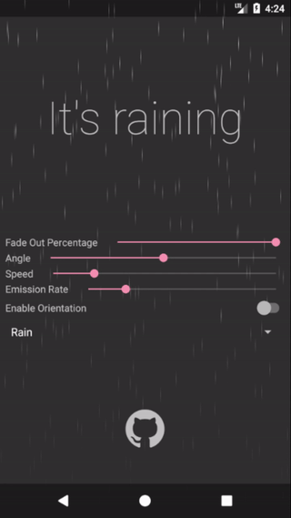
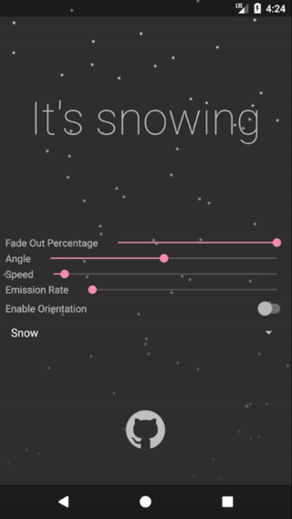
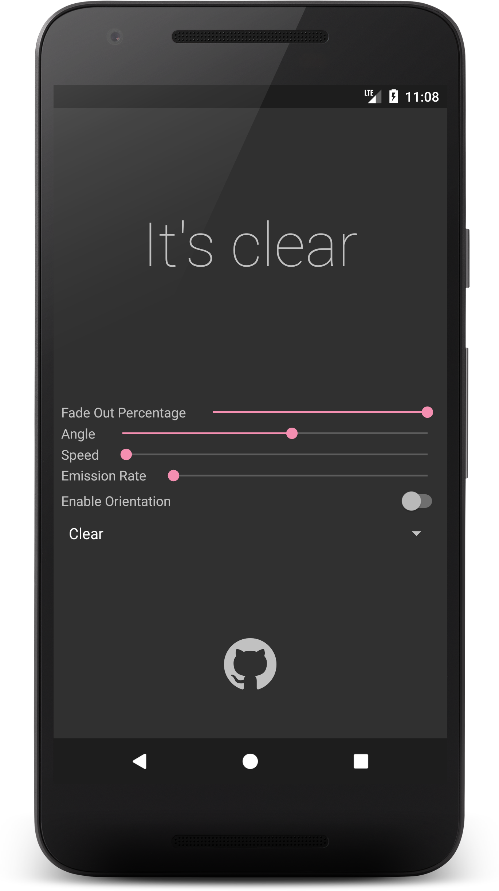
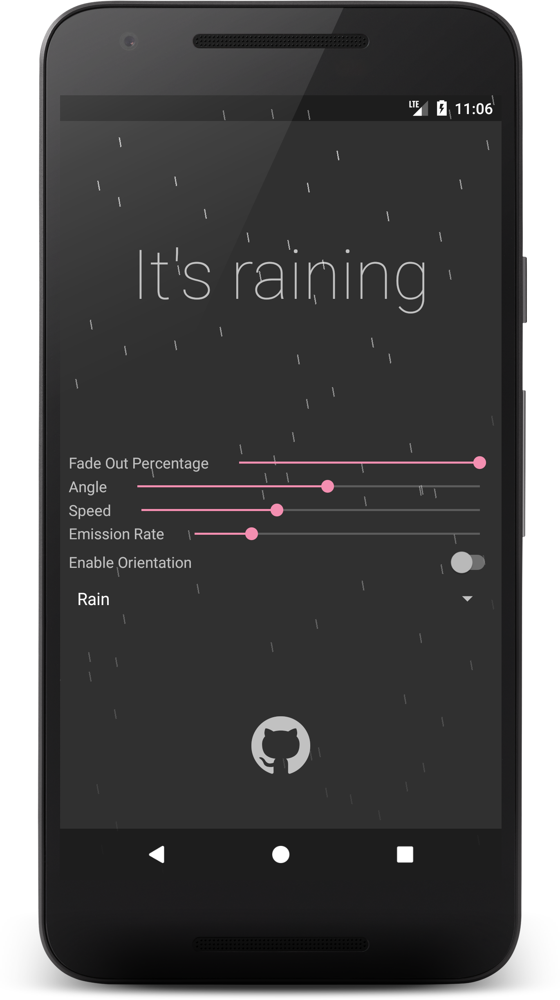
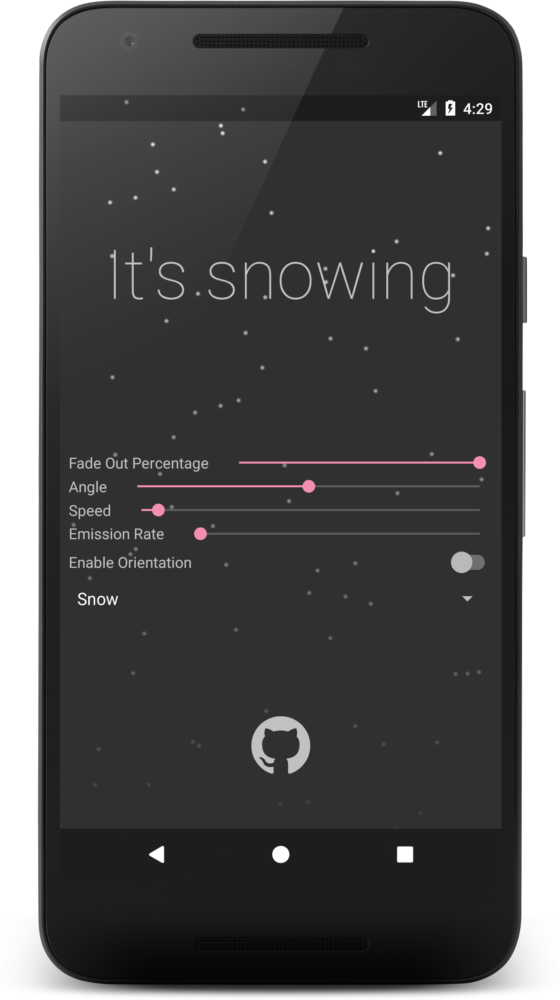

[](https://android-arsenal.com/details/1/4737)
[](http://www.android-gems.com/lib/MatteoBattilana/WeatherView)

<a href="https://play.google.com/store/apps/details?id=xyz.matteobattilana.weatherview"></a> <a href="https://www.youtube.com/watch?v=GDS7Y_aDVcI"></a>

---

# WeatherView

WeatherView is an Android Library that helps you make a cool weather animation for your app.<br/>
This library is based on the [confetti](https://github.com/jinatonic/confetti) library.

 

## Setup
### Android Studio / Gradle
Add the following dependency in your root build.gradle at the end of repositories:
```Gradle
allprojects {
    repositories {
        //...
        maven { url = 'https://jitpack.io' }
    }
}
```
Add the dependency:
```Gradle
dependencies {
    compile 'com.github.MatteoBattilana:WeatherView:2.0.1'
}
```

## Basic usage

For examples of usage, see the demo app.

## Migrations
- 1.2.0 to 2.0.0

	The library moved from the Leonids particle library to the Confetti library, so all methods have changed. The project is also written with Kotlin, so users with Kotlin can use Kotlin-specific features such as property access instead of `setX(...)`/`getX(...)` methods. The demo app's minimum API level is now 16, but the library itself still supports API 14 and up.
	
	Users that want more control over the particles can access the ConfettiManager instance and customize further, but the WeatherView has sensible default values for rain and snow. The WeatherView also enables users to specify a speed and angle rather than an x- and y-velocity.
	
- 1.1.0 to 1.2.0

	Old Name | New Name
	------------ | -------------
	setLifeTime(int time) | setCurrentLifeTime(int time)
	setFadeOutTime(int fadeOutTime) | setCurrentFadeOutTime(int fadeOutTime) 
	setParticles(int particles) | setCurrentParticles(int particles) 
	setAngle(int angle) | setCurrentAngle(int angle)  
	getLifeTime() | getCurrentLifeTime()  
	getFadeOutTime() | getCurrentFadeOutTime() 
	getParticles() | getCurrentParticles()  
	getAngle() | getCurrentAngle()  

	Since the modification exposed, now is possible to have more control of each single parameter. In the older version, the developer could set only the paramenter of the playing or setted animation. Please take a look to the wiki to discover more configuration options.
	
## Screenshots

  

## License details

```
Copyright 2016 Matteo Battilana

Licensed under the Apache License, Version 2.0 (the "License");
you may not use this file except in compliance with the License.
You may obtain a copy of the License at

	http://www.apache.org/licenses/LICENSE-2.0

Unless required by applicable law or agreed to in writing, software
distributed under the License is distributed on an "AS IS" BASIS,
WITHOUT WARRANTIES OR CONDITIONS OF ANY KIND, either express or implied.
See the License for the specific language governing permissions and
limitations under the License.
```

> The library is Free Software, you can use it, extended with no requirement to open source your changes. You can also make paid apps using it.
